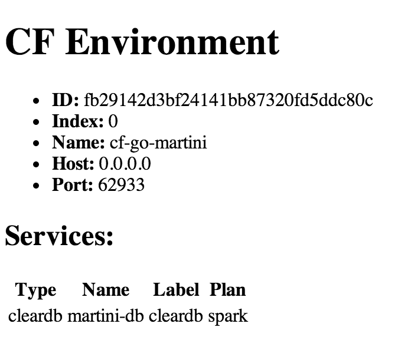
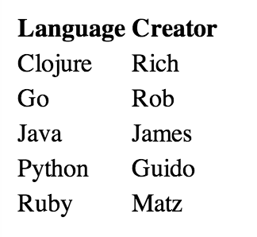

= cf-go-martini

A basic sample application that demonstrates a few things:

* Writing a http://golang.org[Go] application for Cloud Foundry
* Using the http://martini.codegangsta.io/[Martini] web framework
* Using the https://github.com/joefitzgerald/cfenv[cfenv] Go library for interacting with CF application metadata and bound services
* Use of the experimental https://github.com/michaljemala/cloudfoundry-buildpack-go[Cloud Foundry Go Buildpack]

== Running on Cloud Foundry

The application requires binding to a MySQL service. It also requires you to be running https://github.com/cloudfoundry/cli/releases/tag/v6.1.0[version 6.1] of the CF CLI.

----
$ cf cs cleardb spark martini-db
$ cf push --random-route
----

== What you get:

At http://your-random-route:

At http://your-random-route/languages:

